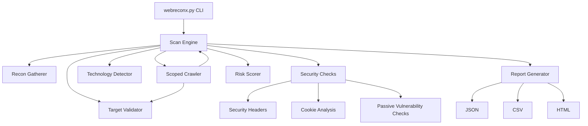

# WebReconX: Web Application Reconnaissance & Security Assessment Framework

WebReconX is a modular Python framework for authorized web reconnaissance and passive security assessment. It provides target validation, scoped crawling, passive reconnaissance, technology fingerprinting, security-header analysis, cookie security analysis, passive vulnerability/configuration checks, OWASP mapping, risk scoring, JSON/CSV/HTML reporting, a local vulnerable test laboratory, and automated tests.

It is designed as a secure, non-destructive configuration audit and policy compliance tool for ethical testing. It was built by refactoring, modularizing, and expanding the baseline design of the open-source repository [web-app-security-scanner](https://github.com/rohitajariwal/web-app-security-scanner) by Rohit Ajariwal.

---

## ╔══════════════════════════════════════════════╗
## ║                  WebReconX                   ║
## ║  Web Application Security Assessment Tool    ║
## ╚══════════════════════════════════════════════╝

---

## Key Technical Enhancements over the Base Repository
* **Refactored Modular Architecture**: Replaced the monolithic script design with independent, decoupled Python packages (`core`, `crawler`, `recon`, `checks`, `scoring`, `reporting`, `cli`, `testlab`).
* **Strict Target & Redirect Scope Validation**: Implemented manual redirection evaluation. Each redirection hop is checked against target domain and loopback boundaries *before* requests are issued to prevent scope evasion.
* **Passive Safety Checks**: Replaced intrusive active injection tests with safe, non-destructive audits of security configurations.
* **Peak + Accumulation Risk Scoring Model**: Implemented a transparent, deterministic algorithm that calculates risk on a 0.0 to 10.0 scale and maps to OWASP Top 10 categories.
* **Multi-Format Reporting**: Generates styled HTML executive reports, flat CSV vulnerability sheets, and structured JSON results.
* **Flask Test Laboratory**: Created a custom vulnerable loopback endpoint lab for safe scanning verification and regression testing.

---

## Architecture Flow



---

## Project Directory Structure

```
.
├── docs/
│   ├── architecture.md
│   ├── ethical-use.md
│   ├── owasp-mapping.md
│   ├── scoring.md
│   └── testing.md
├── tests/
│   ├── __init__.py
│   ├── test_cookies.py
│   ├── test_crawler.py
│   ├── test_headers.py
│   ├── test_integration.py
│   ├── test_reporting.py
│   ├── test_scoring.py
│   ├── test_tech_detect.py
│   └── test_validator.py
├── webreconx/
│   ├── __init__.py
│   ├── checks/
│   │   ├── __init__.py
│   │   ├── base.py
│   │   ├── cookies.py
│   │   ├── headers.py
│   │   └── passive_vulns.py
│   ├── cli/
│   │   ├── __init__.py
│   │   └── cli.py
│   ├── core/
│   │   ├── __init__.py
│   │   ├── engine.py
│   │   ├── finding.py
│   │   └── validator.py
│   ├── crawler/
│   │   ├── __init__.py
│   │   └── crawler.py
│   ├── recon/
│   │   ├── __init__.py
│   │   ├── gatherer.py
│   │   └── tech_detect.py
│   ├── reporting/
│   │   ├── __init__.py
│   │   └── reporter.py
│   ├── scoring/
│   │   ├── __init__.py
│   │   └── scorer.py
│   └── testlab/
│       ├── __init__.py
│       └── app.py
├── .gitignore
├── LICENSE
├── README.md
├── requirements.txt
└── webreconx.py
```

---

## Installation & Getting Started

### 1. Clone & Setup Virtual Environment
```bash
git clone https://github.com/04Sanjanaa/WebReconX-Web-Application-Security-Assessment-Framework.git
cd WebReconX-Web-Application-Security-Assessment-Framework
python -m venv venv
source venv/bin/activate  # On Windows: venv\Scripts\activate
```

### 2. Install Dependencies
```bash
pip install -r requirements.txt
```

---

## Usage Guide

WebReconX supports three main execution subcommands: `scan`, `report`, and `lab`.

### 1. Start the Vulnerable Test Lab
Launch the Flask local laboratory environment to serve test targets:
```bash
python webreconx.py lab --port 5000
```

### 2. Perform a Security Scan

**Lab Mode (Restricted to localhost/127.0.0.1)**
Runs full audits, including sensitive file path checks (e.g. searching for exposed `.env` and `.git/config` files):
```bash
python webreconx.py scan --url http://127.0.0.1:5000 --mode lab --depth 2 --max-pages 25
```

**Passive Mode (Public targets safe)**
Runs safe, non-intrusive metadata, header, and cookie assessments. Blocked from checking sensitive paths by default to maintain strict passive safety boundaries:
```bash
python webreconx.py scan --url https://example.com --mode passive
```

### 3. Generate Reports from JSON
Convert scan results to different formats without re-running the scan:
```bash
python webreconx.py report --input reports/scan.json --format html --output reports/final_report.html
```

---

## Example Scan Output

```
+----------------------------------------------+
|                  WebReconX                   |
|  Web Application Security Assessment Tool    |
|               Version: 1.0.0                 |
+----------------------------------------------+
  *** AUTHORIZED LOCAL LAB TESTING MODE ACTIVE ***  
----------------------------------------------------
Target   : http://127.0.0.1:5000/
Mode     : LAB
Initializing scan, please wait...
Pages    : 7
Duration : 0.84s
Risk Score: 9.7 / 10
Risk Level: CRITICAL

Findings
----------------------------------------------
[CRITICAL] Exposed Environment Configuration File (.env)
[HIGH] Exposed Git Repository Configuration
[HIGH] Missing Content-Security-Policy (CSP) Header
[MEDIUM] Insecure HTTP Protocol Usage
[MEDIUM] Cookie 'session_id' Missing 'HttpOnly' Attribute
[MEDIUM] Cookie 'session_id' Missing 'Secure' Attribute
[MEDIUM] Missing X-Frame-Options (Clickjacking Exposure)
[MEDIUM] Exposed Directory Listing Layout
[LOW] Cookie 'session_id' Insecure 'SameSite' Configuration
[INFO] Server Header Disclosed

Reports
----------------------------------------------
  [+] JSON -> reports/scan.json
  [+] HTML -> reports/scan.html
  [+] CSV  → reports/scan.csv
```

---

## Risk Scoring Model
We calculate the final score using a **Peak + Accumulation Model** to reflect professional threat modeling:
* **Risk Score Scale**: The score ranges from **0.0** (minimal detected risk/no findings) to **10.0** (maximum detected risk/highest critical exposure).
* **Peak**: The final score is anchored to the highest single finding score.
* **Accumulation**: We add **10%** of the sum of all secondary findings' weights to reflect the cumulative risk of multiple smaller exposures.
* **Normalization**: The final score is capped at **10.0** and mapped to risk tiers (CRITICAL, HIGH, MEDIUM, LOW, INFO).

Detailed scoring formulas and examples can be found in the [Risk Scoring Explanation](docs/scoring.md) document.

---

## Automated Tests

We maintain a robust automated test suite using `pytest` to guarantee codebase correctness and redirect boundary safety.

```bash
pytest tests/ -v
```

The scan engine has passed all **31 tests**:
```
tests/test_cookies.py::test_insecure_cookies PASSED
tests/test_cookies.py::test_secure_cookies PASSED
tests/test_cookies.py::test_cookie_individual_flags PASSED
tests/test_crawler.py::test_crawler_limits_and_scope PASSED
tests/test_crawler.py::test_crawler_duplicate_prevention PASSED
tests/test_crawler.py::test_crawler_redirect_out_of_scope PASSED
tests/test_crawler.py::test_crawler_timeout_handling PASSED
tests/test_headers.py::test_missing_headers PASSED
tests/test_headers.py::test_missing_hsts_on_http PASSED
tests/test_headers.py::test_securely_configured_headers PASSED
tests/test_integration.py::test_integration_lab_scan PASSED
tests/test_integration.py::test_integration_passive_mode_sensitive_exclusion PASSED
tests/test_integration.py::test_sensitive_paths_blocked_on_public_targets PASSED
tests/test_reporting.py::test_report_generation PASSED
tests/test_scoring.py::test_single_finding_scoring PASSED
tests/test_scoring.py::test_overall_risk_scoring PASSED
tests/test_scoring.py::test_info_finding_only PASSED
tests/test_scoring.py::test_low_finding_only PASSED
tests/test_scoring.py::test_multiple_medium_findings PASSED
tests/test_scoring.py::test_max_score_capping PASSED
tests/test_tech_detect.py::test_tech_detect_wordpress PASSED
tests/test_tech_detect.py::test_tech_detect_jquery_bootstrap PASSED
tests/test_tech_detect.py::test_tech_detect_flask_django PASSED
tests/test_tech_detect.py::test_tech_detect_no_false_positives PASSED
tests/test_validator.py::test_url_normalization PASSED
tests/test_validator.py::test_localhost_check PASSED
tests/test_validator.py::test_scope_restriction PASSED
tests/test_validator.py::test_lab_mode_restrictions PASSED
tests/test_validator.py::test_url_validation_edge_cases PASSED
tests/test_validator.py::test_localhost_dns_resolution_spoofing PASSED
tests/test_validator.py::test_redirect_scope_boundaries PASSED
```

---

## Documentation Files
To fully explore the framework design, refer to the following documents:
* [Architecture Design Document](docs/architecture.md)
* [OWASP Mapping Philosophy](docs/owasp-mapping.md)
* [Risk Scoring Explanation](docs/scoring.md)
* [Testing Protocol](docs/testing.md)
* [Ethical and Legal Testing Agreement](docs/ethical-use.md)

---

## Original Project Attribution & Licensing

WebReconX was developed using the open-source repository `web-app-security-scanner` by **Rohit Ajariwal** as a foundational reference point.
* **Original Creator**: Rohit Ajariwal
* **Original License**: MIT License (Preserved in full in `LICENSE`)
* **Core Differences**: WebReconX converts the baseline crawling concepts into a secure, highly modular python package, replacing aggressive active form exploitation with passive, non-destructive policy auditing, introducing standardized finding schemas, transparent risk engines, and multi-format reporting.


